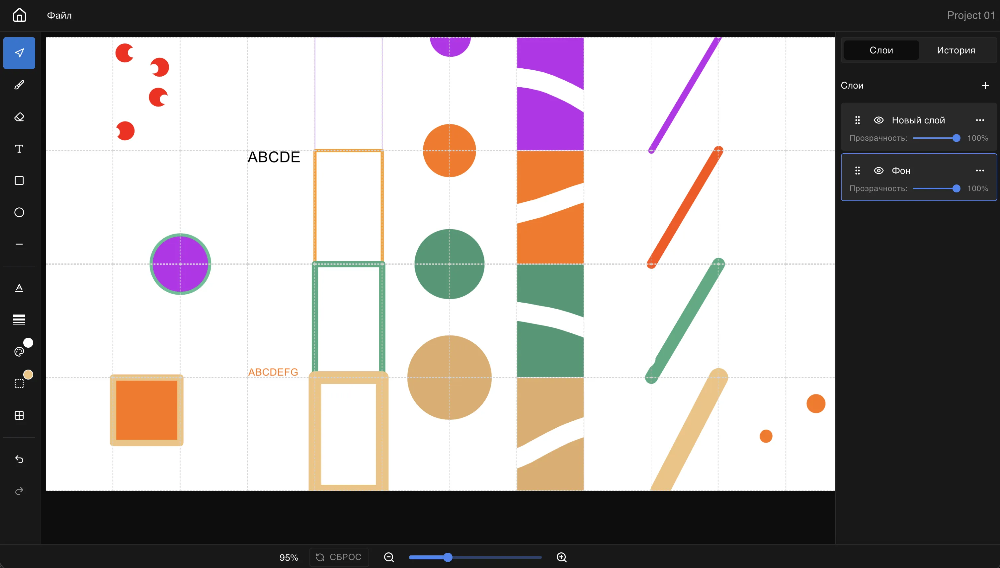

# UI Designer

Проект представляет собой веб-ориентированный графический редактор, позволяющий создавать и редактировать изображения в
браузере. Пользователь может работать с холстом произвольного размера, рисовать различными инструментами, управлять
слоями, просматривать историю действий и экспортировать итоговое изображение в формате PNG. Архитектура включает систему
слоев с настройками прозрачности, возможность скрывать и переупорядочивать элементы, а также полный набор базовых
инструментов — кисть, ластик, линии и фигуры с настраиваемой толщиной и цветом. Приложение сохраняет состояние проектов,
обеспечивает удобную навигацию между ними и предоставляет интерфейс для создания новых холстов. Решение реализовано на
TypeScript и React с использованием менеджера состояния и ориентировано на высокую производительность, удобство
сопровождения и покрытие тестами.

## Демо

🟢 **Live:** [https://ui-graphic-editor.web.app/](https://ui-graphic-editor.web.app/)

## Запуск проекта

1. Склонировать репозиторий `git clone https://github.com/rayonnant/ui-designer.git`
2. Установить зависимости `npm i`
3. Запуск development сервера `npm run dev`
4. Запуск тестов `npm run test`

## 🧑‍💻 Команда и контакты

| Роль        | Имя       |
| :---------- |:----------|
| Team Lead   | Булат     |
| Разработчик | Михаил    |
| Разработчик | Владислав | 
| Разработчик | Александр |
| Разработчик | Сергей    |

## 🎯 Ключевые договорённости по процессу

- **Коммуникация:** Основной чат - [Telegram](https://t.me/c/3250545881/1).
- **Встречи:** Внутренние митинги команды проводятся в 20:00 (по Мск понедельник, среда, пятница).
- **Протоколы встреч:** Все решения и итоги встреч фиксируются:
  - **В репозитории:** В папке `docs/protocols` создавайте файлы в формате `.md` (например, `2024-05-20_standup.md`).
- **Код-ревью:** Все пул-реквесты должны быть одобрены как минимум одним участником команды, прежде чем их сможет
  принять Лид.

## 🛠 Технологический стек

- **Фронтенд:** [React, Typescript, MUI, Redux Toolkit, Konva]
- **Деплой:** [Vercel]

## 📋 Основные требования (Vision)

[Здесь можно кратко перечислить 3-5 ключевых фич или требований к проекту, которые были согласованы.]

- Приложение должно иметь 2 страницы: главная страница с проектами и страница редактирования
- Данные должны сохраняться, чтобы при перезагрузке ничего не пропало
- Код должен быть написан на typescript
- Создавать ветки по Workflow [GitFlow](https://www.gitkraken.com/learn/git/git-flow)

  - Пример feature: feature/feature-name

- Вести коммиты используя [Conventional Commits](https://gist.github.com/qoomon/5dfcdf8eec66a051ecd85625518cfd13)

  - Примеры:

    - feat: add header

    - chore: rename function name

    - docs: update readme
